[中文](./ARCHITECTURE.md) | English

# Architecture Design

This document provides a detailed introduction to DataAgent's system architecture, core capabilities, and technical implementation.

## Overall Architecture Diagram

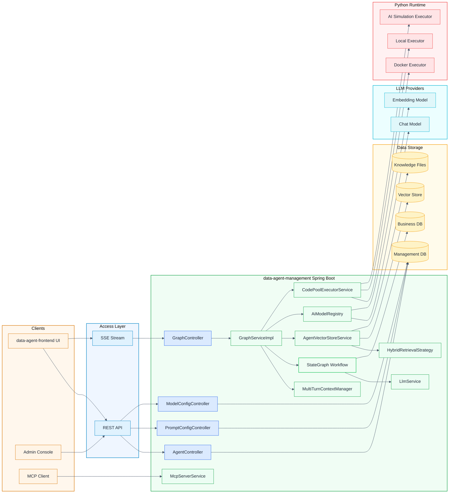

## Runtime Main Flow

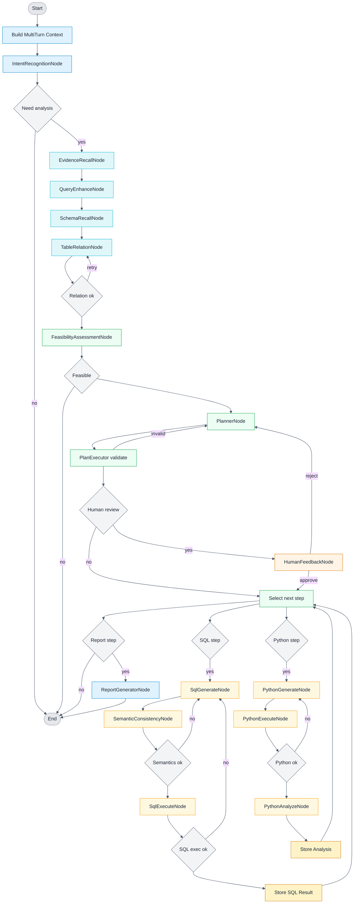

## Workflow Node Deep Dive

Each node in the StateGraph reads from and writes to a shared `OverAllState` object. Nodes are stateless Java beans — all mutable state lives in `OverAllState`, passed between nodes by the graph framework. The sections below explain what each node does, why it was designed that way, and which state keys it reads/writes.

### How the Graph is Built

The entire graph is wired in a single Spring `@Bean` method in `DataAgentConfiguration.java`. There are two building blocks:

**1. Node registration** — each node class is registered by a string name:
```java
StateGraph stateGraph = new StateGraph(NL2SQL_GRAPH_NAME, keyStrategyFactory)
    .addNode(INTENT_RECOGNITION_NODE, nodeBeanUtil.getNodeBeanAsync(IntentRecognitionNode.class))
    .addNode(EVIDENCE_RECALL_NODE,    nodeBeanUtil.getNodeBeanAsync(EvidenceRecallNode.class))
    // ... 14 more nodes
```

**2. Edge wiring** — two edge types connect nodes:

- **Fixed edges** always go to the next node: `.addEdge(PLANNER_NODE, PLAN_EXECUTOR_NODE)`
- **Conditional edges** use a **Dispatcher** — a plain function that reads `OverAllState` and returns the next node name:
```java
.addConditionalEdges(
    INTENT_RECOGNITION_NODE,
    edge_async(new IntentRecognitionDispatcher()),
    Map.of(EVIDENCE_RECALL_NODE, EVIDENCE_RECALL_NODE, END, END)
)
```

Every `*Dispatcher` class is kept separate from its node so routing logic is independently readable and testable. The graph is compiled once at startup into a `CompiledGraph` bean; each user request gets its own `OverAllState` instance keyed by `threadId`.

### Full Graph Wiring

```
START
  └─► IntentRecognitionNode           [IntentRecognitionDispatcher]
        ├─ idle / chit-chat ──────────────────────────────────────► END
        └─ data analysis query
             └─► EvidenceRecallNode   (fixed edge)
                   └─► QueryEnhanceNode              [QueryEnhanceDispatcher]
                         ├─ enhancement failed ───────────────────► END
                         └─ ok
                              └─► SchemaRecallNode   [SchemaRecallDispatcher]
                                    ├─ no active datasource / no tables found ──► END
                                    └─ ok
                                         └─► TableRelationNode    [TableRelationDispatcher]
                                               ├─ retry (schema advice loop) ──► TableRelationNode
                                               ├─ failed ────────────────────► END
                                               └─ ok
                                                    └─► FeasibilityAssessmentNode  [FeasibilityAssessmentDispatcher]
                                                          ├─ not feasible ─────────────────────► END
                                                          └─ feasible
                                                               └─► PlannerNode    (fixed edge)
                                                                     └─► PlanExecutorNode        [PlanExecutorDispatcher]
                                                                           ├─ plan invalid ──────► PlannerNode
                                                                           ├─ max repairs ───────► END
                                                                           ├─ human review enabled
                                                                           │    └─► HumanFeedbackNode  [HumanFeedbackDispatcher]
                                                                           │          ├─ rejected ─────► PlannerNode
                                                                           │          ├─ approved ─────► PlanExecutorNode
                                                                           │          └─ max retries ──► END
                                                                           │
                                                                           ├─ current step = SQL
                                                                           │    └─► SqlGenerateNode     [SqlGenerateDispatcher]
                                                                           │          ├─ max retries ──► END
                                                                           │          └─ ok
                                                                           │               └─► SemanticConsistencyNode  [SemanticConsistenceDispatcher]
                                                                           │                     ├─ fail ───────────────► SqlGenerateNode
                                                                           │                     └─ pass
                                                                           │                          └─► SqlExecuteNode  [SQLExecutorDispatcher]
                                                                           │                                ├─ DB error ──► SqlGenerateNode
                                                                           │                                └─ ok ────────► PlanExecutorNode (next step)
                                                                           │
                                                                           ├─ current step = Python
                                                                           │    └─► PythonGenerateNode  (fixed edge)
                                                                           │          └─► PythonExecuteNode  [PythonExecutorDispatcher]
                                                                           │                ├─ fail, retries left ──────► PythonGenerateNode
                                                                           │                ├─ max retries (fallback) ──► END*
                                                                           │                └─ ok
                                                                           │                     └─► PythonAnalyzeNode  (fixed edge)
                                                                           │                           └─► PlanExecutorNode (next step)
                                                                           │
                                                                           └─ all steps done
                                                                                └─► ReportGeneratorNode  (fixed edge)
                                                                                      └─────────────────────────────────► END
```

> `*` When Python max retries are exceeded, `PYTHON_FALLBACK_MODE=true` is set and the graph routes to END from `PythonExecuteNode`. The report is still generated using SQL results only — Python analysis is replaced with a fixed "unavailable" message by `PythonAnalyzeNode` if it runs in fallback mode.

---

### Phase 1 — Intent & Context

#### 1. IntentRecognitionNode

**What it does:** The first node to execute. It reads the raw user query and the accumulated multi-turn conversation history, then calls the LLM to classify whether the request is an actual data analysis request or casual conversation (e.g., "hello", "thanks").

**Why:** Without this gate, every idle message would trigger the full RAG → SQL → Python → Report pipeline, wasting significant compute. Short-circuiting here keeps idle turns cheap.

**LLM involvement:** Yes — calls `llmService.callUser()` with an intent classification prompt. The response is parsed as JSON into `IntentRecognitionOutputDTO`.

**State reads:** `INPUT_KEY` (raw user query), `MULTI_TURN_CONTEXT` (prior conversation)  
**State writes:** `INTENT_RECOGNITION_NODE_OUTPUT` (DTO with intent type)  
**Routing:** If intent is not data analysis → graph ends immediately.

---

#### 2. EvidenceRecallNode

**What it does:** Retrieves relevant business knowledge and agent-specific knowledge from the vector store to form "evidence" — grounding context that improves SQL generation accuracy. It runs in three sub-phases:

1. **Query rewriting** (LLM): Rewrites the user query into a standalone retrieval question that is independent of conversation history (important for multi-turn sessions where the query may use pronouns like "it" or "that").
2. **Vector retrieval** (no LLM): Calls `AgentVectorStoreService` to retrieve business term documents and agent knowledge documents via similarity search. Optionally uses hybrid search (vector + keyword via `AbstractHybridRetrievalStrategy`).
3. **Evidence assembly** (no LLM): Formats retrieved documents into structured evidence strings, distinguishing FAQ/QA pairs from general documents.

**Why:** Raw user queries often contain ambiguous business terminology (e.g., "active users" could mean different things in different companies). Evidence injects domain-specific definitions and examples so the LLM can generate contextually correct SQL.

**LLM involvement:** Yes for query rewriting only; retrieval and formatting are pure code.

**State reads:** `INPUT_KEY`, `AGENT_ID`, `MULTI_TURN_CONTEXT`  
**State writes:** `EVIDENCE` (formatted evidence string, or "None" if empty)

---

#### 3. QueryEnhanceNode

**What it does:** Refines the user query by combining it with the retrieved evidence and conversation history. The LLM produces a "canonical query" — a disambiguated, fully-specified version of the original question — along with extracted keywords.

**Why:** Users often ask vague or incomplete questions. By the time we reach schema recall and SQL generation, we need a precise, unambiguous question that the LLM can reliably translate to SQL. Query enhancement is a pre-normalization step that removes ambiguity before it propagates.

**LLM involvement:** Yes — calls `llmService.callUser()` with an enhancement prompt. Output is parsed into `QueryEnhanceOutputDTO`. Markdown artifacts in the response are cleaned with `MarkdownParserUtil.extractRawText()`.

**State reads:** `INPUT_KEY`, `EVIDENCE`, `MULTI_TURN_CONTEXT`  
**State writes:** `QUERY_ENHANCE_NODE_OUTPUT` (DTO containing `canonicalQuery` and `keywords`)

---

### Phase 2 — Schema Resolution

#### 4. SchemaRecallNode

**What it does:** Retrieves the database tables and columns that are most relevant to the canonical query using vector similarity search against pre-indexed schema metadata.

- Looks up the agent's active datasource from `agentDatasourceMapper`.
- Calls `schemaService.getTableDocumentsByDatasource()` to retrieve table-level matches.
- Calls `schemaService.getColumnDocumentsByTableName()` for column-level matches on recalled tables.

**Why:** Enterprise databases often have hundreds of tables. Feeding all schema to the LLM is token-prohibitive and noise-inducing. Semantic schema recall narrows the context to only what is relevant, improving SQL accuracy and reducing hallucination.

**LLM involvement:** No — pure vector similarity search.

**State reads:** `QUERY_ENHANCE_NODE_OUTPUT`, `AGENT_ID`  
**State writes:** `TABLE_DOCUMENTS_FOR_SCHEMA_OUTPUT`, `COLUMN_DOCUMENTS__FOR_SCHEMA_OUTPUT`, `SCHEMA_RECALL_NODE_OUTPUT`  
**Failure path:** If no active datasource or no tables found, returns an error message and the graph terminates.

---

#### 5. TableRelationNode

**What it does:** The most complex pre-planning node. It runs in three phases:

1. **Initial schema building** (no LLM): Merges recalled table and column documents with logical foreign key relationships (JOIN paths stored in the management DB) into a `SchemaDTO`.
2. **Schema fine-selection** (LLM): Calls `nl2SqlService.fineSelect()` to have the LLM intelligently prune the schema to only the tables/columns needed for this specific query. If a previous SQL attempt failed and left a `SQL_GENERATE_SCHEMA_MISSING_ADVICE`, that advice is fed back here so the LLM can include previously missed tables.
3. **Semantic model generation** (no LLM): Fetches custom semantic models (aliases, business rules, computed field definitions) for the selected tables and assembles them into a prompt segment for the Planner.

**Why:** Even after schema recall, the selected tables may include redundant entries. Fine-selection ensures the schema passed to the Planner and SQL generator is minimal and precise. Semantic models allow domain experts to encode business logic (e.g., "revenue = price × quantity × (1 - discount)") that the LLM uses during SQL generation.

**LLM involvement:** Yes for fine-selection phase only.

**State reads:** `QUERY_ENHANCE_NODE_OUTPUT`, `EVIDENCE`, `TABLE_DOCUMENTS_FOR_SCHEMA_OUTPUT`, `COLUMN_DOCUMENTS__FOR_SCHEMA_OUTPUT`, `AGENT_ID`, `SQL_GENERATE_SCHEMA_MISSING_ADVICE` (optional)  
**State writes:** `TABLE_RELATION_OUTPUT` (final `SchemaDTO`), `DB_DIALECT_TYPE`, `GENEGRATED_SEMANTIC_MODEL_PROMPT`, `TABLE_RELATION_RETRY_COUNT`, `TABLE_RELATION_EXCEPTION_OUTPUT`

---

### Phase 3 — Feasibility & Planning

#### 6. FeasibilityAssessmentNode

**What it does:** Asks the LLM to assess whether the request can be answered given the recalled schema and evidence. For example, if a user asks "show monthly sales by region" but the schema has no region column, this node detects infeasibility and the graph short-circuits.

**Why:** Generating SQL for an infeasible question wastes retries and produces misleading results. This gate catches structural mismatches early, before any SQL or Python generation is attempted, and can return a clear "cannot answer" message to the user.

**LLM involvement:** Yes — calls `llmService.callUser()` with the schema and canonical query. Returns a plain-text assessment.

**State reads:** `QUERY_ENHANCE_NODE_OUTPUT`, `TABLE_RELATION_OUTPUT`, `EVIDENCE`, `MULTI_TURN_CONTEXT`  
**State writes:** `FEASIBILITY_ASSESSMENT_NODE_OUTPUT` (assessment text)  
**Routing:** If not feasible → graph ends; otherwise continues to Planner.

---

#### 7. PlannerNode

**What it does:** Generates a structured multi-step execution plan specifying which tools to call (`SqlGenerateNode`, `PythonGenerateNode`, `ReportGeneratorNode`) and with what parameters. The plan is a JSON object conforming to the `Plan` class schema.

For **NL2SQL-only mode** (`IS_ONLY_NL2SQL=true`), a hard-coded single-step SQL plan is returned without calling the LLM.

For **normal mode**, the LLM is given the canonical query, full schema, evidence, semantic model, and an output format descriptor. It produces a decomposed plan.

**Plan repair:** If `PlanExecutorNode` rejected a previous plan (validation failure or human rejection), `PLAN_VALIDATION_ERROR` contains the rejection reason. The Planner is re-called with the previous plan and error included in the prompt, instructing it to generate a corrected plan.

**Why:** Complex analytical questions often require multiple SQL queries (e.g., fetch raw data, then pivot it) followed by Python analysis. A planning step lets the LLM reason about the full answer strategy before executing anything, which produces more coherent multi-step analyses than a single-shot approach.

**LLM involvement:** Yes (except NL2SQL-only mode).

**State reads:** `IS_ONLY_NL2SQL`, `QUERY_ENHANCE_NODE_OUTPUT`, `GENEGRATED_SEMANTIC_MODEL_PROMPT`, `TABLE_RELATION_OUTPUT`, `EVIDENCE`, `PLAN_VALIDATION_ERROR`, `PLANNER_NODE_OUTPUT`  
**State writes:** `PLANNER_NODE_OUTPUT` (Plan JSON)

---

#### 8. PlanExecutorNode

**What it does:** Acts as the plan orchestrator and router. It does NOT execute anything itself — it reads the plan, validates its structure, tracks which step is currently being executed (`PLAN_CURRENT_STEP`), and routes to the appropriate execution node.

**Validation checks:**
- Plan is not null and has at least one step.
- Each step's tool name is one of: `SQL_GENERATE_NODE`, `PYTHON_GENERATE_NODE`, `REPORT_GENERATOR_NODE`.
- Required parameters for each tool type are non-empty (e.g., SQL steps must have a non-empty `instruction`).

**Routing logic:**
- Validation failure → back to PlannerNode (increments `PLAN_REPAIR_COUNT`).
- Human review enabled → to HumanFeedbackNode.
- All steps complete → to ReportGeneratorNode.
- Current step is SQL → to SqlGenerateNode.
- Current step is Python → to PythonGenerateNode.

**Why:** Separating validation and routing from execution keeps each node single-responsibility. The executor is a pure state machine with no LLM calls, making it fast and deterministic. Having explicit validation before execution prevents ill-formed plans from causing cryptic errors downstream.

**LLM involvement:** No.

**State reads:** `PLANNER_NODE_OUTPUT`, `HUMAN_REVIEW_ENABLED`, `PLAN_CURRENT_STEP`, `IS_ONLY_NL2SQL`  
**State writes:** `PLAN_VALIDATION_STATUS`, `PLAN_VALIDATION_ERROR`, `PLAN_REPAIR_COUNT`, `PLAN_NEXT_NODE`

---

#### 9. HumanFeedbackNode

**What it does:** Implements the human-in-the-loop pause point. When human review is enabled, the graph pauses here using `CompiledGraph.interruptBefore(HUMAN_FEEDBACK_NODE)`. The plan generated so far is streamed to the user, who can approve or reject it with optional written feedback.

**Approve path:** Sets `HUMAN_REVIEW_ENABLED=false`, routes to `PlanExecutorNode` to begin execution.  
**Reject path:** Stores the user's feedback text as `PLAN_VALIDATION_ERROR`, resets `PLAN_CURRENT_STEP=1`, increments `PLAN_REPAIR_COUNT`, and routes back to `PlannerNode` for regeneration. After 3 rejections, routes to END.

**Resume mechanism:** The client resubmits to `/api/graph/stream-search` with the original `threadId` plus the feedback payload. `GraphServiceImpl` retrieves the paused `StateSnapshot` by `threadId` and resumes graph execution from `HumanFeedbackNode`.

**Why:** For high-stakes analyses (financial, compliance), allowing a human to review and redirect the execution plan before any SQL runs against production databases is critical for safety and trust.

**LLM involvement:** No — pure routing logic.

**State reads:** `HUMAN_FEEDBACK_DATA`, `PLAN_REPAIR_COUNT`  
**State writes:** `human_next_node`, `PLAN_REPAIR_COUNT`, `PLAN_CURRENT_STEP`, `HUMAN_REVIEW_ENABLED`, `PLAN_VALIDATION_ERROR`, `PLANNER_NODE_OUTPUT`

---

### Phase 4 — SQL Execution Loop

The SQL loop is a mini-retry cycle: Generate → Validate Semantics → Execute. Any failure loops back to SqlGenerateNode with the error as context.

#### 10. SqlGenerateNode

**What it does:** Generates the SQL query for the current execution step. The step's `instruction` (from the plan) describes what data to fetch. The node passes the instruction, canonical query, schema, evidence, and dialect to `nl2SqlService.generateSql()`.

**Retry path:** If `SQL_REGENERATE_REASON` is set (from SemanticConsistencyNode or SqlExecuteNode), the previously generated SQL and the error/feedback are included in the regeneration prompt so the LLM can produce a corrected version.

**Max retries:** Configurable via `DataAgentProperties.maxSqlRetryCount`. On exhaustion, returns a formatted error message.

**Why:** SQL generation rarely succeeds perfectly on the first try for complex queries. Providing the failed SQL and the specific error (whether a semantic mismatch or a DB execution exception) lets the LLM make targeted corrections rather than starting from scratch.

**LLM involvement:** Yes — calls `nl2SqlService.generateSql()` which internally uses the LLM.

**State reads:** `SQL_GENERATE_COUNT`, `PLAN_CURRENT_STEP`, `SQL_REGENERATE_REASON`, `SQL_GENERATE_OUTPUT`, `EVIDENCE`, `TABLE_RELATION_OUTPUT`, `QUERY_ENHANCE_NODE_OUTPUT`, `DB_DIALECT_TYPE`  
**State writes:** `SQL_GENERATE_OUTPUT` (SQL string), `SQL_GENERATE_COUNT`, `SQL_REGENERATE_REASON` (reset)

---

#### 11. SemanticConsistencyNode

**What it does:** Validates that the generated SQL actually answers the user's question — not just that it is syntactically valid. The LLM is given the SQL, schema, evidence, canonical query, and the step instruction, and asked: "Does this SQL correctly implement the user's intent?"

If the response starts with "不通过" (not passed), validation fails and `SQL_REGENERATE_REASON` is populated with the LLM's explanation.

**Why:** Syntactically valid SQL can be semantically wrong. For example, `SELECT COUNT(*)` when the user asked for a sum, or JOINs that silently duplicate rows. This node catches logical errors before they produce misleading results that the user would have to spot themselves.

**LLM involvement:** Yes — calls `nl2SqlService.performSemanticConsistency()`.

**State reads:** `SQL_GENERATE_OUTPUT`, `EVIDENCE`, `TABLE_RELATION_OUTPUT`, `DB_DIALECT_TYPE`, current step instruction, `QUERY_ENHANCE_NODE_OUTPUT`  
**State writes:** `SEMANTIC_CONSISTENCY_NODE_OUTPUT` (true/false), `SQL_REGENERATE_REASON` (if failed)

---

#### 12. SqlExecuteNode

**What it does:** Executes the validated SQL against the business database and stores the results. Additionally (optionally), it calls the LLM to generate a `DisplayStyleBO` — a chart configuration (type, axes, title) for how the frontend should visualize this result set.

**Execution flow:**
1. Gets DB config via `databaseUtil.getAgentDbConfig(agentId)`.
2. Executes SQL via the appropriate `Accessor` for the datasource.
3. If `isEnableSqlResultChart()` is true, calls LLM with a sample of results (max 20 rows) to suggest chart type and configuration.
4. Stores `ResultSetBO` (raw data + chart config) in `SQL_EXECUTE_NODE_OUTPUT[step_N]`.
5. Stores raw rows in `SQL_RESULT_LIST_MEMORY` (consumed by Python steps).
6. Increments `PLAN_CURRENT_STEP`.

**Error path:** On DB exception, populates `SQL_REGENERATE_REASON` with the exception message, routing back to SqlGenerateNode.

**Why:** Combining execution with chart recommendation is efficient because the same data sample used for chart inference is already in memory. Storing raw rows separately in `SQL_RESULT_LIST_MEMORY` makes them available to Python code without re-querying the database.

**LLM involvement:** Optional — chart type recommendation only.

**State reads:** `SQL_GENERATE_OUTPUT`, `PLAN_CURRENT_STEP`, `AGENT_ID`  
**State writes:** `SQL_EXECUTE_NODE_OUTPUT`, `SQL_REGENERATE_REASON`, `SQL_RESULT_LIST_MEMORY`, `PLAN_CURRENT_STEP`, `SQL_GENERATE_COUNT` (reset to 0 on success)

---

### Phase 5 — Python Execution Loop

Python steps follow the same generate → execute → analyze pattern as SQL steps, but with an explicit analysis node to interpret numerical/statistical output.

#### 13. PythonGenerateNode

**What it does:** Generates Python code for the current plan step using the schema, a sample of SQL results (first 5 rows from `SQL_RESULT_LIST_MEMORY`), and the step's `instruction`. The LLM is given memory/timeout limits from `CodeExecutorProperties` so it can write resource-aware code.

**Retry path:** If `PYTHON_IS_SUCCESS=false` (previous execution failed), the last generated code and the error message are appended to the prompt, asking the LLM to fix the specific issue.

**Why:** Python is used for operations SQL cannot perform efficiently: statistical analysis, machine learning inference, complex pivots, and chart data preparation. Providing sample data as context allows the LLM to generate code that works with the actual data shapes it will encounter.

**LLM involvement:** Yes — calls `llmService.call(systemPrompt, userPrompt)`.

**State reads:** `TABLE_RELATION_OUTPUT`, `SQL_RESULT_LIST_MEMORY`, `PYTHON_IS_SUCCESS`, `PYTHON_TRIES_COUNT`, `QUERY_ENHANCE_NODE_OUTPUT`, current step tool parameters  
**State writes:** `PYTHON_GENERATE_NODE_OUTPUT` (Python code string), `PYTHON_TRIES_COUNT`

---

#### 14. PythonExecuteNode

**What it does:** Executes the generated Python code in an isolated sandbox via `CodePoolExecutorService`. Three executor backends are supported:

- **Docker** (default): Runs code in a `continuumio/anaconda3` container. Temp files are written and stdout is captured.
- **Local**: Runs in the local JVM process environment.
- **AI Simulation**: Simulates execution using an LLM (fallback for environments without Docker).

The node parses stdout as JSON and normalizes Unicode escapes before storing results.

**Max retries:** Configurable via `CodeExecutorProperties.pythonMaxTriesCount`. On exhaustion, `PYTHON_FALLBACK_MODE=true` is set and execution continues with an empty result rather than blocking the pipeline.

**Why:** Sandboxed execution is a security requirement — user-influenced Python code must never run in the main JVM process. Docker isolation also allows resource limits (CPU, memory, timeout) to be enforced. The graceful fallback mode ensures the report can still be generated even if Python analysis fails, using SQL results alone.

**LLM involvement:** No (unless AI Simulation executor is configured).

**State reads:** `PYTHON_GENERATE_NODE_OUTPUT`, `SQL_RESULT_LIST_MEMORY`, `PYTHON_TRIES_COUNT`  
**State writes:** `PYTHON_EXECUTE_NODE_OUTPUT`, `PYTHON_IS_SUCCESS`, `PYTHON_FALLBACK_MODE`

---

#### 15. PythonAnalyzeNode

**What it does:** Interprets the Python execution output using the LLM. It takes the raw stdout JSON (numerical results, computed values, generated chart data) and the original canonical query, and asks the LLM to write a human-readable analysis: what the numbers mean, what trends are visible, what conclusions can be drawn.

**Fallback path:** If `PYTHON_FALLBACK_MODE=true`, skips the LLM and stores a fixed "Python analysis unavailable" message.

After analysis, stores the result in `SQL_EXECUTE_NODE_OUTPUT[step_N_analysis]` and increments `PLAN_CURRENT_STEP`.

**Why:** Python output is often a JSON blob of numbers. Without interpretation, the user would see raw arrays in their report. This node converts computational output into narrative insight, maintaining the report's readability regardless of how complex the underlying analysis is.

**LLM involvement:** Yes (unless fallback mode).

**State reads:** `PYTHON_EXECUTE_NODE_OUTPUT`, `QUERY_ENHANCE_NODE_OUTPUT`, `PLAN_CURRENT_STEP`, `SQL_EXECUTE_NODE_OUTPUT`, `PYTHON_FALLBACK_MODE`  
**State writes:** `SQL_EXECUTE_NODE_OUTPUT[step_N_analysis]`, `PLAN_CURRENT_STEP`

---

### Phase 6 — Report Generation

#### 16. ReportGeneratorNode

**What it does:** The final synthesis node. It assembles all execution artifacts — the plan structure, SQL result sets with chart configs, Python analyses, and the plan's `summaryAndRecommendations` — into a comprehensive report using the LLM.

**Prompt customization:** Before calling the LLM, the node fetches active prompt optimization configs from `UserPromptService` (sorted by `priority` and `display_order`). These are user-defined report directives (e.g., "always include an executive summary", "use formal tone") appended to the base report prompt via `PromptHelper.buildReportGeneratorPromptWithOptimization()`.

**Output:** A Markdown document (or HTML for rich rendering) streamed token-by-token to the frontend via SSE. After generation, `SQL_EXECUTE_NODE_OUTPUT`, `PLAN_CURRENT_STEP`, and `PLANNER_NODE_OUTPUT` are cleared from state.

**Why:** Separating report generation from execution lets each execution node focus on producing structured data, while the report node focuses on narrative synthesis. Prompt optimization configs allow domain teams to customize report style without code changes — a no-code extensibility point.

**LLM involvement:** Yes — calls `llmService.callUser()` with the assembled report prompt.

**State reads:** `PLANNER_NODE_OUTPUT`, `QUERY_ENHANCE_NODE_OUTPUT`, `PLAN_CURRENT_STEP`, `SQL_EXECUTE_NODE_OUTPUT`  
**State writes:** `RESULT` (final report), clears `SQL_EXECUTE_NODE_OUTPUT`, `PLAN_CURRENT_STEP`, `PLANNER_NODE_OUTPUT`

---

### State Key Reference

| Key | Type | Written by | Purpose |
|---|---|---|---|
| `INPUT_KEY` | String | Caller | Raw user query |
| `AGENT_ID` | String | Caller | Agent context for multi-tenant isolation |
| `MULTI_TURN_CONTEXT` | String | MultiTurnContextManager | Prior conversation history |
| `INTENT_RECOGNITION_NODE_OUTPUT` | DTO | IntentRecognitionNode | Intent classification result |
| `EVIDENCE` | String | EvidenceRecallNode | Formatted RAG evidence |
| `QUERY_ENHANCE_NODE_OUTPUT` | DTO | QueryEnhanceNode | Canonical query + keywords |
| `TABLE_DOCUMENTS_FOR_SCHEMA_OUTPUT` | List | SchemaRecallNode | Recalled table documents |
| `COLUMN_DOCUMENTS__FOR_SCHEMA_OUTPUT` | List | SchemaRecallNode | Recalled column documents |
| `TABLE_RELATION_OUTPUT` | SchemaDTO | TableRelationNode | Final pruned schema |
| `DB_DIALECT_TYPE` | String | TableRelationNode | MySQL / PostgreSQL / etc. |
| `GENEGRATED_SEMANTIC_MODEL_PROMPT` | String | TableRelationNode | Semantic model context for Planner |
| `FEASIBILITY_ASSESSMENT_NODE_OUTPUT` | String | FeasibilityAssessmentNode | Feasibility verdict |
| `PLANNER_NODE_OUTPUT` | String (JSON) | PlannerNode | Execution plan |
| `PLAN_CURRENT_STEP` | Integer | PlanExecutorNode / SqlExecuteNode / PythonAnalyzeNode | Step cursor |
| `PLAN_NEXT_NODE` | String | PlanExecutorNode | Next node name for routing |
| `PLAN_VALIDATION_STATUS` | Boolean | PlanExecutorNode | Whether plan passed validation |
| `PLAN_VALIDATION_ERROR` | String | PlanExecutorNode / HumanFeedbackNode | Validation or rejection reason |
| `PLAN_REPAIR_COUNT` | Integer | PlanExecutorNode / HumanFeedbackNode | Retry counter |
| `HUMAN_REVIEW_ENABLED` | Boolean | Caller / HumanFeedbackNode | Human-in-the-loop toggle |
| `HUMAN_FEEDBACK_DATA` | Map | Caller (resume request) | Approval and feedback text |
| `SQL_GENERATE_OUTPUT` | String | SqlGenerateNode | Generated SQL |
| `SQL_GENERATE_COUNT` | Integer | SqlGenerateNode / SqlExecuteNode | SQL retry counter |
| `SQL_REGENERATE_REASON` | SqlRetryDto | SemanticConsistencyNode / SqlExecuteNode | Error context for retry |
| `SQL_GENERATE_SCHEMA_MISSING_ADVICE` | String | SqlGenerateNode | Missing schema hint for TableRelationNode |
| `SEMANTIC_CONSISTENCY_NODE_OUTPUT` | Boolean | SemanticConsistencyNode | Semantic check result |
| `SQL_EXECUTE_NODE_OUTPUT` | Map | SqlExecuteNode / PythonAnalyzeNode | Step results keyed by step number |
| `SQL_RESULT_LIST_MEMORY` | List | SqlExecuteNode | Raw rows passed to Python |
| `PYTHON_GENERATE_NODE_OUTPUT` | String | PythonGenerateNode | Generated Python code |
| `PYTHON_TRIES_COUNT` | Integer | PythonGenerateNode | Python retry counter |
| `PYTHON_IS_SUCCESS` | Boolean | PythonExecuteNode | Python execution outcome |
| `PYTHON_EXECUTE_NODE_OUTPUT` | String | PythonExecuteNode | Python stdout (JSON) |
| `PYTHON_FALLBACK_MODE` | Boolean | PythonExecuteNode | Graceful degradation flag |
| `IS_ONLY_NL2SQL` | Boolean | Caller | Skip Python + Report, return SQL only |
| `RESULT` | String | ReportGeneratorNode | Final report content |

---

## Key Capability Description

### 1. Human Feedback Mechanism

#### Key Points

- **Entry**: Runtime request parameter `humanFeedback=true` (`GraphController` → `GraphServiceImpl`)
- **Data Field**: `human_review_enabled` uses request parameter
- **Graph Orchestration**: `PlanExecutorNode` detects `HUMAN_REVIEW_ENABLED`, transitions to `HumanFeedbackNode`
- **Pause and Resume**: `CompiledGraph` uses `interruptBefore(HUMAN_FEEDBACK_NODE)`, enters "wait" state when no feedback, continues execution through `threadId` when feedback arrives
- **Feedback Result**: Approve continues execution; Reject returns to `PlannerNode` and triggers replanning

#### Architecture Diagram

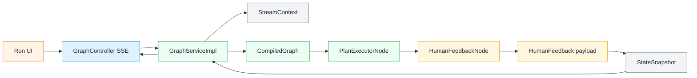

#### Flow Diagram

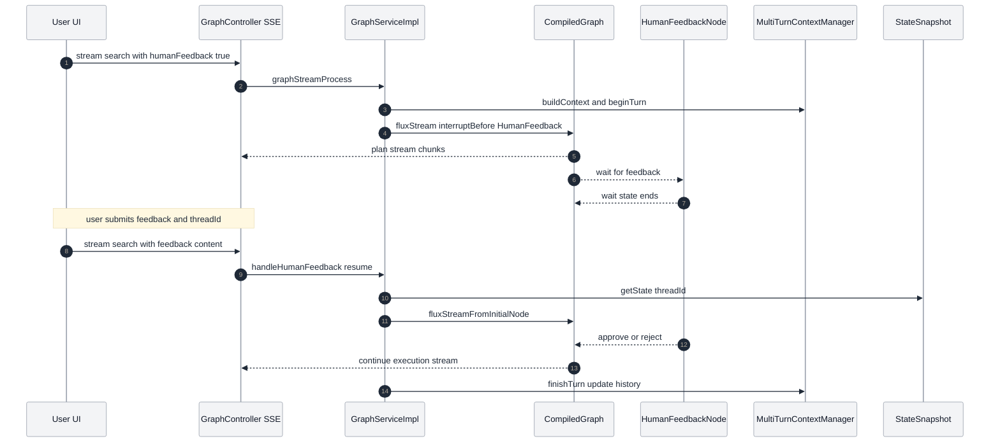

### 2. Prompt Configuration and Auto-Optimization

#### Key Points

- **Configuration Entry**: `/api/prompt-config/*`, data table `user_prompt_config`
- **Scope**: Supports binding by `agentId` or global configuration (`agentId` is null)
- **Prompt Types**: `report-generator`, `planner`, `sql-generator`, `python-generator`, `rewrite`
- **Auto-Optimization Method**: `ReportGeneratorNode` fetches enabled configurations (sorted by `priority` and `display_order`), concatenates "optimization requirements" through `PromptHelper.buildReportGeneratorPromptWithOptimization`
- **Current Implementation Focus**: Report generation node has implemented optimization; other types are reserved capabilities

#### Architecture Diagram

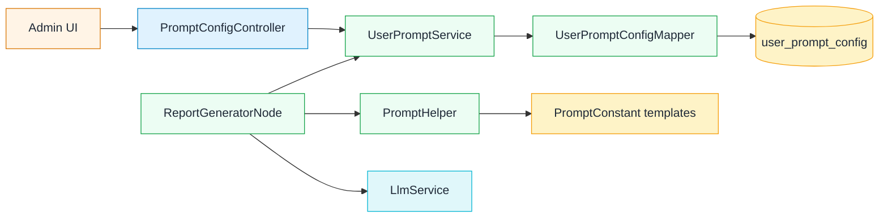

#### Flow Diagram

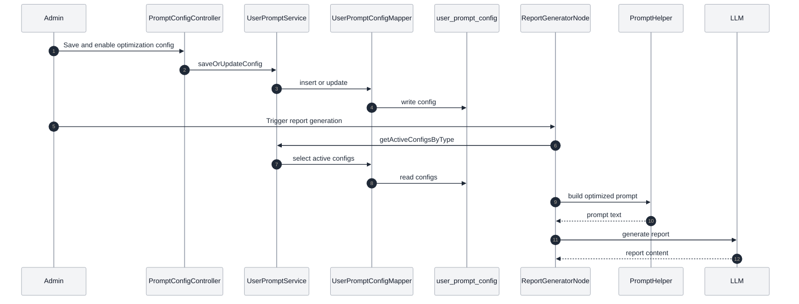

### 3. RAG Retrieval Enhancement

#### Key Points

- **Query Rewriting**: `EvidenceRecallNode` calls LLM to generate independent retrieval questions
- **Recall Channels**: `AgentVectorStoreService` performs vector retrieval; optional hybrid retrieval (vector + keyword, `AbstractHybridRetrievalStrategy`)
- **Document Types**: Business knowledge + Agent knowledge, filtered by metadata and merged as evidence injected into subsequent prompts
- **Key Configuration**: `spring.ai.alibaba.data-agent.vector-store.enable-hybrid-search` and similarity/TopK parameters

#### Architecture Diagram

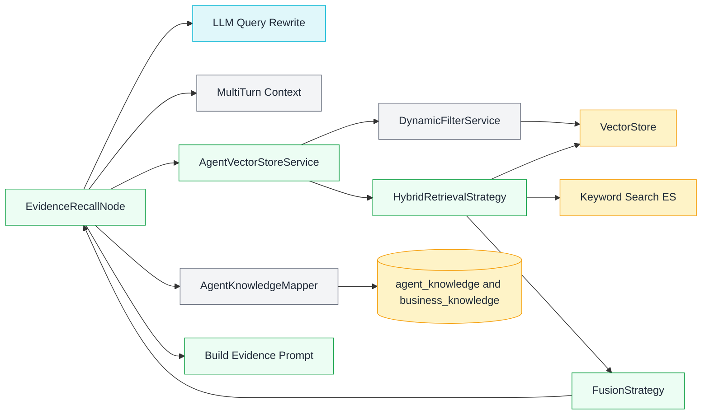

#### Flow Diagram

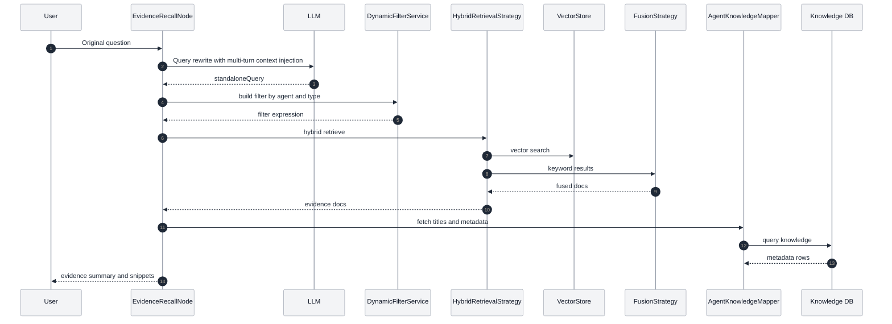

### 4. Report Generation and Summary Generation

#### Key Points

- **Report Node**: `ReportGeneratorNode` reads plan, SQL/Python results and summary suggestions (`summary_and_recommendations`)
- **Output Format**: Default HTML, `plainReport=true` outputs Markdown (concise report)
- **Optimization Prompts**: Automatically concatenates optimization configuration before generating report

#### Architecture Diagram

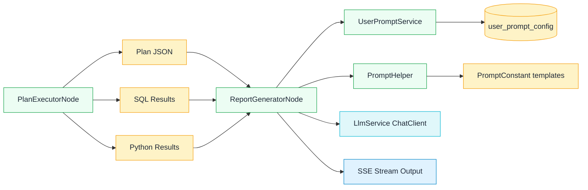

#### Flow Diagram

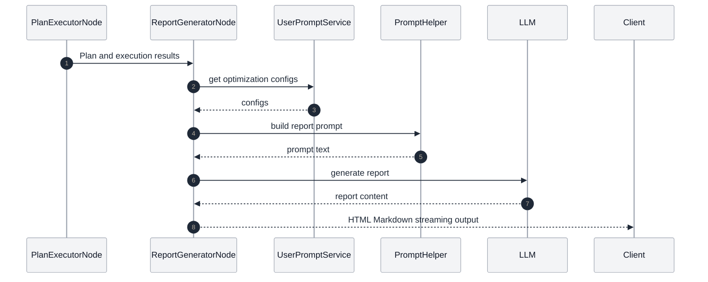

### 5. Streaming Output and Multi-turn Conversation

#### Key Points

- **Streaming Output**: `GraphController` SSE + `GraphServiceImpl` streaming processing
- **Text Markers**: `TextType` marks SQL/JSON/HTML/Markdown in the stream, frontend renders accordingly
- **Multi-turn Conversation**: `MultiTurnContextManager` records "user question + planning results", injected into subsequent requests
- **Mode Switching**: `spring.ai.alibaba.data-agent.llm-service-type` supports `STREAM/BLOCK`

#### Architecture Diagram

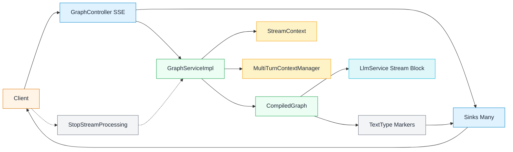

#### Flow Diagram

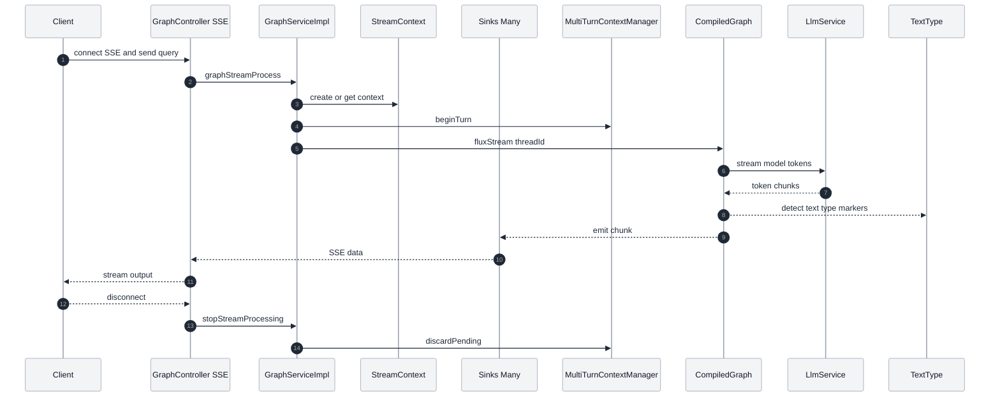

### 6. MCP and Multi-Model Scheduling

#### Key Points

- **MCP**: `McpServerService` provides NL2SQL and Agent list tools, using Mcp Server Boot Starter
- **Multi-Model Scheduling**: `ModelConfig*` configures models, `AiModelRegistry` caches current Chat/Embedding models and supports hot-swapping (only one active model per type at a time)
- **Built-in Tools**: `nl2SqlToolCallback`, `listAgentsToolCallback`

#### Architecture Diagram

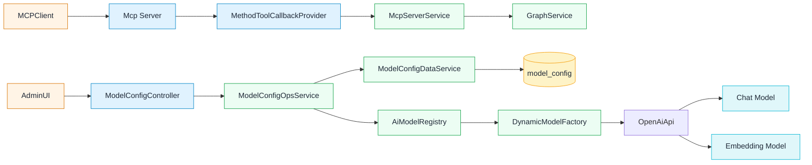

#### Flow Diagram

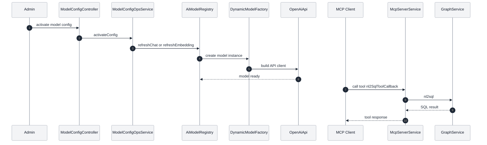

### 7. API Key and Permission Management

#### Key Points

- **Management**: `AgentController` supports generating, resetting, deleting, and enabling/disabling API Keys
- **Data Fields**: `agent.api_key` and `agent.api_key_enabled`
- **Calling Method**: Request header `X-API-Key` (requires implementing backend validation logic yourself)
- **Note**: By default, the backend does not intercept `X-API-Key` for authentication; production needs to add validation yourself

#### Architecture Diagram

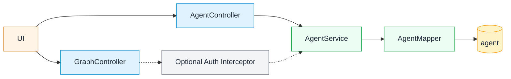

#### Flow Diagram

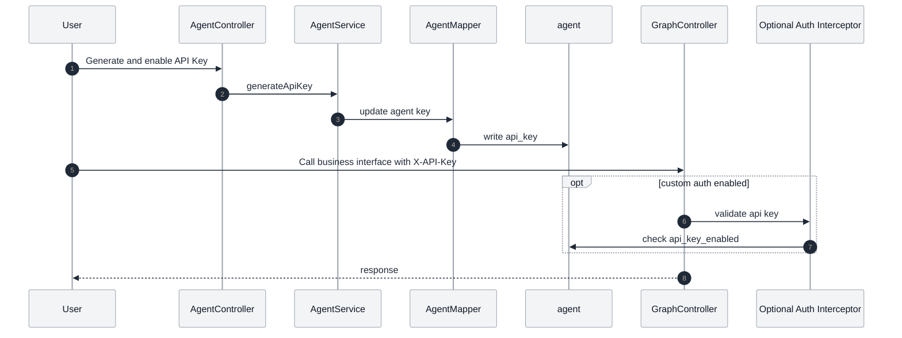

### 8. Python Execution and Result Return

#### Key Points

- **Code Generation**: `PythonGenerateNode` generates Python based on plan and SQL results
- **Code Execution**: `PythonExecuteNode` uses `CodePoolExecutorService` (Docker/Local/AI simulation)
- **Execution Configuration**: `spring.ai.alibaba.data-agent.code-executor.*` (default Docker image `continuumio/anaconda3:latest`)
- **Result Return**: Execution results are written back to `PYTHON_EXECUTE_NODE_OUTPUT`, `PythonAnalyzeNode` summarizes and writes to `SQL_EXECUTE_NODE_OUTPUT` for final report

#### Architecture Diagram

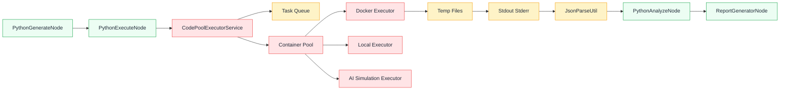

#### Flow Diagram

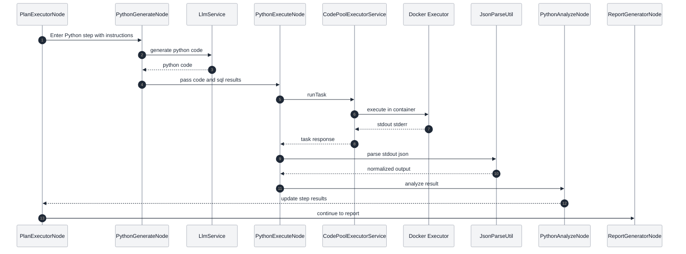


## Related Documents

- [Quick Start](QUICK_START-en.md) - Installation and configuration guide
- [Advanced Features](ADVANCED_FEATURES-en.md) - API calls and MCP server
- [Developer Documentation](DEVELOPER_GUIDE-en.md) - Contribution guide
