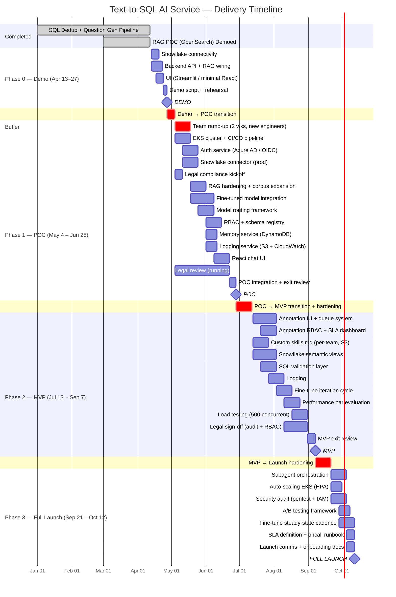

# Text-to-SQL AI Service — Product & Engineering Plan
**Version:** Draft v0.4 (Internal)
**Date:** 2026-04-13
**Target Launch:** October 2026
**Team:** 6 Full-Stack Engineers (junior, ~50% new to AI/ML area)

---

## What's Already Built (POC Assets)

| Component | Status | Details |
|-----------|--------|---------|
| SQL dedup pipeline | Done | Custom AST normalization script; table name node extraction; high-frequency SQL selected as high-quality corpus |
| LLM question generation | Done | LLM generates natural language questions from each canonical SQL |
| OpenSearch index | Done | (question, SQL) pair index; semantic retrieval on user question → matched SQL |
| RAG retrieval POC | Demoed | End-to-end: user question → semantic search → top-K (question, SQL) pairs → prompt injection |

**Impact on demo:** The hardest ML piece is validated. Demo can now show real semantic retrieval — not just hardcoded context. Only two remaining demo risks are Snowflake connectivity and the UI.

---

## Open Questions

These must be resolved in Phase 1 Week 1 — they affect architecture decisions downstream.

| # | Question | Owner | Unblocks |
|---|---------|-------|---------|
| OQ-1 | OIDC provider: is it Azure AD? Confirm with IT | IT / Lead | Auth service design |
| OQ-2 | Snowflake auth model: key-pair vs OAuth vs Snowflake SSO? | Snowflake admin | Snowflake connector design |
| OQ-3 | Which off-the-shelf embedding model was used in the RAG POC? Must standardize before corpus expansion | ML team | OpenSearch index scaling |
| OQ-4 | Fine-tuned model performance bar: what SQL exec success rate + intent match % qualifies as "ready"? | Lead + ML | Model routing thresholds |
| OQ-5 | Fine-tuned model hosting format: EKS custom instance or Bedrock custom model endpoint? | ML / Infra | Phase 1 model integration |

---

## Timeline



> **Color key:** Blue = active work | Red = buffer / ramp-up periods | Grey = completed

---

## System Architecture

```
┌─────────────────────────────────────────────────────────────┐
│                     User (Chat UI)                          │
│               React web app, streaming responses            │
└────────────────────────────┬────────────────────────────────┘
                             │ HTTPS / WebSocket
┌────────────────────────────▼────────────────────────────────┐
│                   API Gateway (AWS EKS)                     │
│              FastAPI, JWT auth middleware, RBAC             │
└──┬──────────┬──────────┬──────────┬──────────┬─────────────┘
   │          │          │          │          │
   ▼          ▼          ▼          ▼          ▼
 LLM       RAG /     Snowflake   Memory    Logging /
Service   Retrieval  Connector   Service   Annotation
   │       (POC       │          │          │
   │       done)      │          │          │
   ▼          ▼          ▼          ▼          ▼
Fine-tuned  OpenSearch  Snowflake  DynamoDB    S3
model     (question,   Semantic   (sessions) (Q&A pairs,
  +       SQL pairs)   Views                 training data)
Fallback:
Claude
Sonnet 4.5
/ Opus 4.6
(Bedrock)
```

---

## Component Specifications

### 1. Chat Frontend
- React + TypeScript, streaming token display
- Multi-turn conversation with history panel
- SQL result preview (table view), copy-to-clipboard
- User login / auth flow (OIDC — likely Azure AD, per OQ-1)
- Flag response button (feeds annotation queue)
- Custom skills.md upload (per-user, per-team)

### 2. API Gateway / Backend (FastAPI on EKS)
- REST + WebSocket endpoints
- JWT session management, token refresh
- RBAC middleware: maps authenticated user → Snowflake role
- Request routing to LLM, RAG, Memory, Snowflake services
- Rate limiting, abuse detection

### 3. Auth Service (build from scratch)
- OIDC/SAML SSO — likely Azure AD (confirm OQ-1)
- User → Snowflake role mapping stored in config/DB
- **Security-critical:** RBAC enforced at prompt level — schema context injected into LLM is filtered by user's permitted tables, preventing leakage via model response
- **Also enforced at RAG level** — retrieval only returns (question, SQL) pairs involving tables the user can access
- Audit log of all access events (financial data compliance)

### 4. LLM Service — Two-Tier Strategy

**Tier 1: Fine-tuned model (primary)**
- Custom training pipeline already in progress (separate team/process)
- Optimized for company SQL patterns, table naming, business terminology
- Hosted on EKS custom instance or Bedrock custom model endpoint (per OQ-5)

**Tier 2: Large host model fallback**
- Claude Sonnet 4.5 via AWS Bedrock (standard queries)
- Claude Opus 4.6 (complex multi-join / subagent decomposition)
- Activated when fine-tuned model output fails confidence or validation thresholds
- Also used as ceiling benchmark during fine-tuned model evaluation

**Model routing at inference:**
```
User question
  → Fine-tuned model → SQL + confidence score
  → SQL syntax validation
  → SQL schema validation (tables/columns in user's permitted schema?)
  → If all pass: return result (Tier 1)
  → If any fail: route to Claude Sonnet/Opus (Tier 2)
  → Log: tier used, fallback reason (every request)
```

**Prompt construction (both tiers):**
1. System prompt + schema context (RBAC-filtered)
2. System-level skills.md
3. Custom-level skills.md (per-team/user, runtime-loaded from S3)
4. Top-K retrieved (question, SQL) pairs from RAG
5. Session memory (recent N turns)
6. User question

**Subagent layer (Full Launch):** Complex multi-part questions → decompose into sub-queries → parallel subagents each generate SQL → combine results

### 5. RAG / Retrieval Service *(POC complete — productionize for Phase 1)*

**Validated architecture:**
- Custom dedup: AST normalization, table name node extraction, high-frequency SQL = high-quality corpus
- LLM generates natural language questions from each canonical SQL
- OpenSearch index: (question, SQL) pairs
- Retrieval: semantic search on user question → top-K (question, SQL) → inject SQL into prompt

**Why (question, SQL) pairs work:** Users ask questions, not SQL. Matching against LLM-generated questions semantically outperforms raw SQL syntax search.

**Off-the-shelf embedding model** (not custom-built): confirm which model used in POC (OQ-3); standardize before corpus expansion. Options on AWS Bedrock: Titan Embeddings v2, Cohere Embed.

**Production hardening tasks (Phase 1):**
- OpenSearch cluster: replication, backups, production sizing
- Expand index to full 2M SQL corpus
- RBAC filter on retrieval: only return SQL pairs for tables the user can access
- Schema registry: Snowflake metadata (tables, columns, types) cached and refreshed on schedule
- S3: versioned corpus storage (raw → canonical → question-SQL pairs)

### 6. Snowflake Connector (custom-built)
- Python service on EKS
- Auth model: TBD (OQ-2) — key-pair, OAuth, or Snowflake SSO
- Authenticates per user's Snowflake role (not a shared service account)
- Semantic view queries (all schemas/tables in scope)
- SQL validation before execution: syntax check + table/column check against user's permitted schema
- Query timeout enforcement, result pagination
- Credentials via AWS Secrets Manager (no direct credential storage)

### 7. Memory Service
- **Store:** DynamoDB (per-user, per-conversation)
- Stores: message history, generated SQL, execution results
- TTL: configurable (default 30 days)
- Phase 1: retrieve recent N turns (default 10)
- Phase 2+: semantic retrieval of relevant past sessions
- API: create session, append turn, get session, list sessions

### 8. Logging Service
- All Q&A pairs → S3 (Parquet, partitioned by `date/team/user`)
- Key fields: `user_id`, `team`, `session_id`, `turn_id`, `question`, `retrieved_sql_pairs`, `generated_sql`, `model_tier_used`, `fallback_reason`, `execution_status`, `latency_ms`, `user_flagged`
- CloudWatch: latency p50/p95, error rates, **fallback rate** (% routed to large model — high = fine-tuned model needs more training data)
- Athena: queryable log layer for analysts

### 9. Human Annotation Service

**Annotators:** Core team + domain analysts per department (analysts scoped to their own team's queries)

**Queue sources and priority:**

| Source | Est. Volume | SLA | Rationale |
|--------|------------|-----|-----------|
| User-flagged | ~1–5% of queries | 48 hrs | User explicitly signaled a problem |
| Fallback-triggered | Varies by fine-tune quality | 72 hrs | Highest signal for fine-tuning |
| Random sample | 5% of all queries | 1 week | Quality monitoring baseline |

**Scoring rubric:**
- SQL executability (runs without error)
- Intent match (answers the question asked)
- Data authorization (only permitted tables accessed)
- Preference rating 1–5 (for fine-tune preference data)

**Export:** Labeled JSONL → S3 → feeds custom training pipeline

### 10. Skills.md System
- **System-level:** All users. Company SQL conventions, table naming standards, business term glossary (e.g., "revenue" → `fact_revenue.amount` in `finance_db`), Snowflake warehouse/schema map
- **Custom-level:** Per-team markdown stored in S3. Fetched at request time based on user's team; injected into prompt. Runtime-loadable with no service restart.
- **Storage:** S3-backed, Git-versioned. Team leads update via PR or simple upload UI (Phase 2+)
- **Format:** Plain markdown, no special parser required

---

## Phased Delivery Plan

### Phase 0 — 2-Week Demo (April 13 – April 27)
**Goal:** Working demo with live RAG retrieval + Snowflake execution.

| # | Task | Notes |
|---|------|-------|
| 0.1 | Snowflake connection (service account for demo only) | **Start Day 1 — highest risk item** |
| 0.2 | FastAPI backend: question → RAG → LLM → SQL endpoint | Wire existing OpenSearch retrieval code into request path |
| 0.3 | Integrate existing OpenSearch (question, SQL) index | Reuse POC retrieval; top-3 SQL pairs in prompt |
| 0.4 | Claude Sonnet 4.5 on Bedrock as LLM (fine-tuned model in Phase 1) | Simple prompt: filtered schema + retrieved SQL + question |
| 0.5 | Streamlit or minimal React UI | Streamlit acceptable for demo speed |
| 0.6 | Flat-file Q&A logging | Write Q&A to JSON file |
| 0.7 | Demo script: 5–8 questions across 2 departments | Pre-test every question; rehearse full flow |

**Explicitly out of scope for demo:** Auth, RBAC, memory, annotation, skills.md, fine-tuned model

---

### Phase 1 — POC Formalization (May 4 – June 28, ~8 weeks)
**Goal:** Production-ready system for 10 internal users. Harden existing POC assets; add auth, infra, model routing.

| # | Task | Priority |
|---|------|---------|
| 1.1 | EKS cluster setup, CI/CD (GitHub Actions → ECR → EKS) | P0 |
| 1.2 | Auth service: Azure AD OIDC + user/role mapping (OQ-1) | P0 |
| 1.3 | RBAC: prompt-level schema filter + RAG retrieval filter | P0 |
| 1.4 | Production Snowflake connector (OQ-2 auth method, Secrets Manager) | P0 |
| 1.5 | OpenSearch hardening: replication, backups, production sizing | P0 |
| 1.6 | Corpus expansion to full dataset; validate retrieval quality | P0 |
| 1.7 | Fine-tuned model endpoint integration (OQ-5) | P0 |
| 1.8 | Model routing framework: confidence scoring + fallback to Claude | P0 |
| 1.9 | Memory service: DynamoDB sessions, multi-turn | P1 |
| 1.10 | Logging service: S3 Parquet + CloudWatch + fallback rate metric | P1 |
| 1.11 | System-level skills.md wired into prompt | P1 |
| 1.12 | React chat UI: streaming, history panel, SQL table view | P1 |
| 1.13 | Schema registry: Snowflake metadata crawl + cache | P1 |
| 1.14 | **Legal / compliance kickoff meeting** | P0 (Legal) |
| 1.15 | Team ramp-up: 2-week AI/ML + system onboarding | People |
| 1.16 | Architecture decision records (ADRs) + runbooks | Ops |

**Team allocation:**
- 2 engineers: Backend + Auth + EKS + model routing
- 2 engineers: RAG hardening + corpus expansion + fine-tuned model integration
- 1 engineer: Snowflake connector + schema registry
- 1 engineer: Frontend (React UI)

**Exit criteria:** 10 users active, 50+ queries/day, fine-tuned model handling >60% without fallback, >75% SQL correctness.

---

### Phase 2 — MVP (July 13 – September 7, ~8 weeks)
**Goal:** 100+ users, annotation pipeline live, full Snowflake schema coverage.

| # | Task | Priority |
|---|------|---------|
| 2.1 | Human annotation UI + queue system | P0 |
| 2.2 | Annotation RBAC (analysts scoped to their team's queries) | P0 |
| 2.3 | Annotation SLA tracking dashboard | P0 |
| 2.4 | JSONL export pipeline → custom training pipeline | P0 |
| 2.5 | Custom-level skills.md: per-team S3 + runtime loading | P0 |
| 2.6 | Snowflake semantic view support (full schema coverage) | P0 |
| 2.7 | SQL validation layer (pre-execution) | P0 |
| 2.8 | Logging: Athena queryable layer + operational dashboards | P1 |
| 2.9 | Fine-tune iteration: annotated data → retrain → evaluate → deploy | P1 |
| 2.10 | Performance bar evaluation (fine-tuned vs Claude ceiling) | P1 |
| 2.11 | Load testing: 500 concurrent users | P1 |
| 2.12 | Session memory: semantic retrieval of relevant past sessions | P2 |
| 2.13 | Legal sign-off: audit log, RBAC, data retention | P0 (Legal) |
| 2.14 | Admin UI: skills.md upload, user/role management | P2 |

**Exit criteria:** 100+ users, annotation SLA met for all queue sources, fallback rate <30%, <5s p95 latency.

---

### Phase 3 — Full Launch (September 21 – October 12)
**Goal:** Scale to thousands, subagents live, fine-tune in steady state.

| # | Task | Priority |
|---|------|---------|
| 3.1 | Subagent orchestration: complex query decomposition → parallel sub-SQL | P0 |
| 3.2 | Auto-scaling EKS (HPA on request volume) | P0 |
| 3.3 | Security audit (penetration test + IAM review) | P0 |
| 3.4 | A/B testing framework (% traffic to new model versions) | P1 |
| 3.5 | Fine-tune steady state: monthly retrain cadence | P1 |
| 3.6 | Self-serve schema onboarding (teams add Snowflake views without eng) | P1 |
| 3.7 | SLA definition + oncall runbook | P0 |
| 3.8 | Query result caching (frequent identical questions) | P2 |
| 3.9 | Custom skills.md web UI for non-engineers | P2 |
| 3.10 | Full launch communications + user onboarding docs | P0 |

---

## Fine-Tuning Strategy & Performance Framework

**Current state:** Custom training pipeline in progress (separate team/process). This system consumes the fine-tuned model as a service.

**Performance bar (define in Phase 1 — OQ-4):**
- Primary: SQL execution success rate on held-out eval set (suggested threshold: >85%)
- Secondary: Intent match score from annotation rubric (suggested: >80%)
- These thresholds gate promotion of new model checkpoints to production

**Inference fallback thresholds (calibrate in Phase 1):**
- Confidence score: below X → fallback to Claude
- SQL validation failure → always fallback
- All decisions logged with reason

**Iteration loop:**
1. Live traffic → logging → annotation queue
2. Annotators label (fallback-triggered cases are highest priority)
3. Labeled JSONL → custom training pipeline → new checkpoint
4. Evaluate against Claude Sonnet 4.5 as ceiling benchmark
5. If above performance bar → promote to production
6. Target cadence: monthly retrains once annotation pipeline is stable (Phase 2+)

---

## Tech Stack Summary

| Layer | Technology |
|-------|-----------|
| Hosting | AWS EKS |
| LLM Primary | Fine-tuned model (custom training pipeline) |
| LLM Fallback | Claude Sonnet 4.5 / Opus 4.6 — AWS Bedrock |
| Frontend | React + TypeScript |
| Backend API | FastAPI (Python) |
| Auth | Custom OIDC/SAML — likely Azure AD |
| RAG Index | AWS OpenSearch (question, SQL pairs) |
| Embedding | Off-the-shelf (TBD: Bedrock Titan v2 or Cohere Embed via Bedrock — confirm OQ-3) |
| Storage | S3 (corpus, logs, skills, training data, annotation exports) |
| Data Warehouse | Snowflake (custom connector, semantic views) |
| Memory | DynamoDB |
| Observability | CloudWatch + custom dashboards |
| CI/CD | GitHub Actions → ECR → EKS |
| Secrets | AWS Secrets Manager |
| Log Query | AWS Athena |

---

## Compliance & Legal Workstream

| Task | Phase | Status |
|------|-------|--------|
| Legal kickoff meeting (financial data, audit trail, data residency) | Phase 1 Week 1 | Not started |
| Audit log design approved by legal | Phase 1 | Not started |
| RBAC access control design reviewed by security team | Phase 1 | Not started |
| Data retention policy (DynamoDB TTL + S3 log lifecycle) | Phase 1 | Not started |
| Define PII/financial field handling in logs | Phase 1 | Not started |
| Legal sign-off before MVP launch | Phase 2 | Not started |
| Penetration test + IAM review | Phase 3 | Not started |
| Multi-region / DR assessment (if required) | Phase 3 | Not started |

---

## Key Risks & Mitigations

| Risk | Impact | Mitigation |
|------|--------|-----------|
| Fine-tuned model below performance bar | High | Claude fallback is built into the architecture from Day 1; system ships regardless of fine-tune quality |
| Legal compliance delay (financial data) | High | Kickoff Week 1 of Phase 1; legal sign-off required before MVP goes live |
| Snowflake RBAC complexity | High | Map all user roles in Phase 1; validate with security team; both prompt and RAG layers enforce RBAC |
| RAG retrieval quality at scale | Medium | POC validated on subset; measure top-K precision before expanding to full corpus |
| Junior team + new domain | High | 2-week ramp-up in Phase 1; pair lead with junior on each workstream |
| Azure AD OIDC integration unknown | Medium | Confirm provider ASAP (OQ-1); well-documented but integration complexity varies |
| OQ-3 embedding model mismatch | Medium | Do not expand corpus before confirming which model was used in POC — index rebuild is expensive |
| Demo Snowflake connectivity | Critical | Start Day 1; all other demo pieces already exist |

---

## Milestone Summary (High-Level — for Sharing with Other Teams)

| Milestone | Date | What Stakeholders See |
|-----------|------|-----------------------|
| **Demo** | April 27, 2026 | Live text-to-SQL with semantic retrieval on Snowflake data |
| **POC** | June 28, 2026 | 10 internal users, auth, fine-tuned model, multi-turn memory |
| **MVP** | September 7, 2026 | 100+ users, annotation pipeline, all Snowflake schemas, production-hardened |
| **Full Launch** | October 12, 2026 | Thousands of users, subagent query decomposition, monthly fine-tune cycle |
